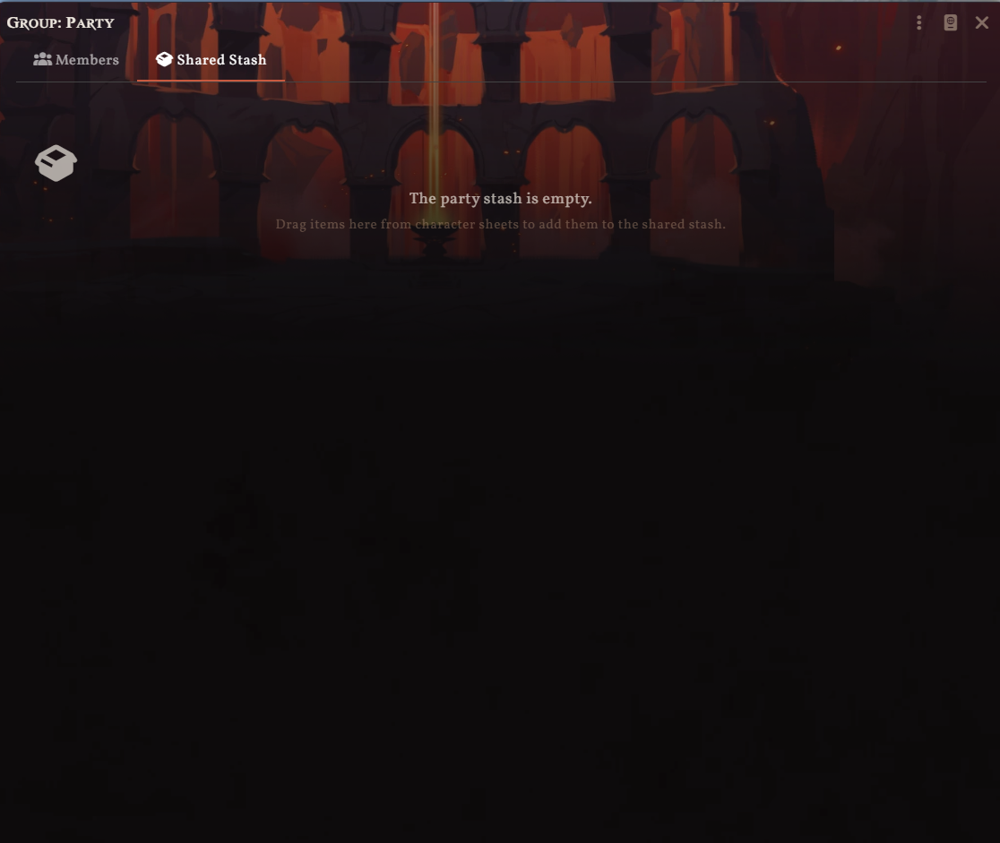

# Crucible Party Stash


A shared party inventory for the [Crucible](https://foundryvtt.com/packages/crucible) game system in [Foundry Virtual Tabletop](https://foundryvtt.com/).

Adds a **Stash** tab to the Group Actor sheet where players can pool items, distribute loot, and manage shared resources — all without leaving the group sheet.



## Features

- **Shared Stash Tab** — A new tab on the Crucible Group Actor sheet for pooling party items alongside the existing Members tab.
- **Drag & Drop** — Drag items from any character sheet into the stash, or drag them back out to a character.
- **Give to Character** — Click the give button to hand an item directly to any party member via a dropdown picker.
- **Move or Copy** — Optionally remove the item from the source character when stashing, or keep a copy on both.
- **Capacity Limit** — Set a maximum number of items the stash can hold (0 = unlimited).
- **Role-Based Access** — Configure the minimum user role required to see and use the stash. GMs always have access.
- **Quantity Display** — Shows item quantities for stackable Crucible items.

## Installation

### From Foundry

1. Open Foundry VTT and go to **Add-on Modules** → **Install Module**.
2. Paste the following URL into the **Manifest URL** field:
   ```
   https://github.com/Ebonhawk3829/crucible-party-stash/releases/latest/download/module.json
   ```
3. Click **Install**.
4. Enable the module in your world.

### Manual

Download `module.zip` from the [latest release](https://github.com/Ebonhawk3829/crucible-party-stash/releases/latest), extract it into your `Data/modules/` directory, and restart Foundry.

## Requirements

| Requirement | Version |
|---|---|
| Foundry VTT | v14+ |
| Crucible | 0.10.0+ |

This module **only** works with the Crucible game system. It hooks into `CrucibleGroupActorSheet` and will not activate for other systems.

## Settings

All settings are world-scoped and configurable by the GM under **Settings** → **Module Settings** → **Crucible Party Stash**.

| Setting | Default | Description |
|---|---|---|
| Stash Capacity | 0 (unlimited) | Maximum number of items the stash can hold. Set to 0 for no limit. |
| Confirm Transfer | Enabled | Prompt the user to confirm whether to move or copy when dragging an item from a character into the stash. |
| Minimum Role | Player | The minimum user role required to see and interact with the stash tab. |

## Usage

1. **Open a Group Actor sheet** — the module adds a tab bar with **Members** and **Stash** tabs.
2. **Add items** — Drag an item from any Hero or Adversary character sheet onto the Stash tab.
3. **Retrieve items** — Either drag an item from the stash onto a character sheet, or click the give button and pick a party member from the list.
4. **Remove items** — Click the trash icon to delete an item from the stash entirely.

## Compatibility

This module targets Crucible's `CrucibleGroupActorSheet` and uses Foundry V14 APIs including `ApplicationV2`, `DialogV2`, `NumberField` settings, and Handlebars template rendering under the `foundry.applications.handlebars` namespace.

It is designed to be non-destructive — stash data is stored as a flag on the Group Actor (`crucible-party-stash.stash`) and does not modify any core Crucible data models.

### Known Interactions

- **Ember** — Compatible. The module does not interfere with Ember's adventure content or Vista engine. Stash data persists independently of adventure imports.

## License

This module is released under the [MIT License](LICENSE).